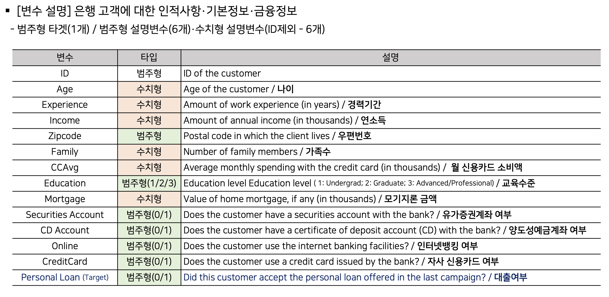
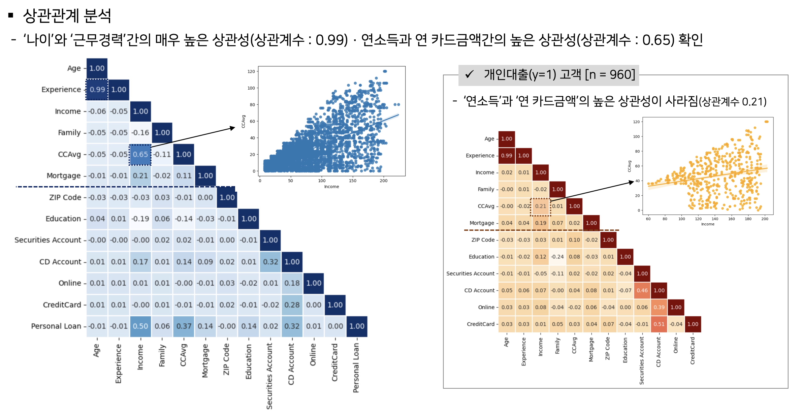
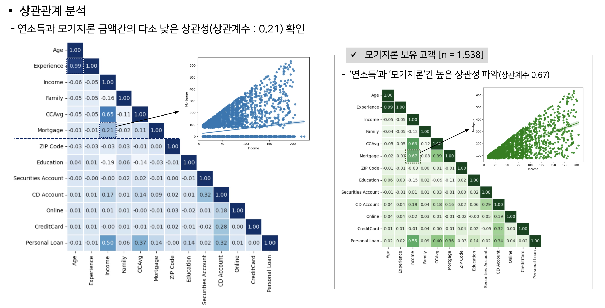
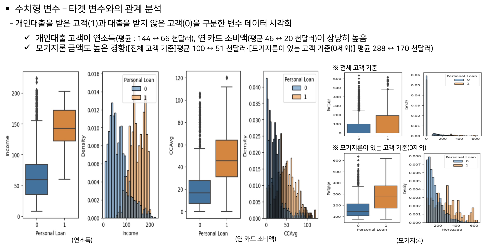
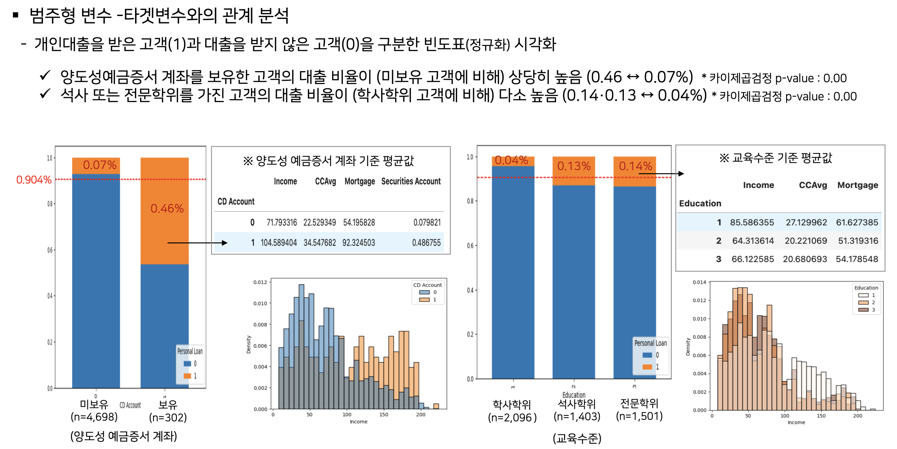
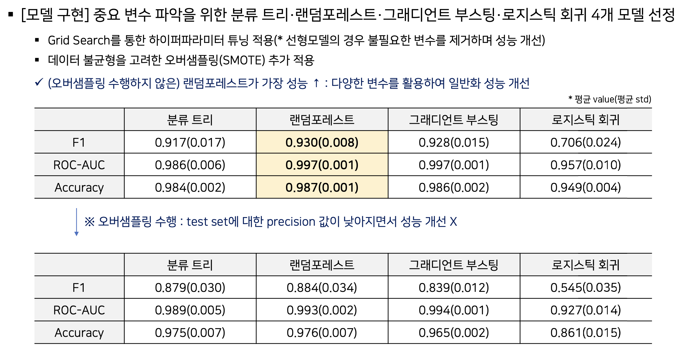
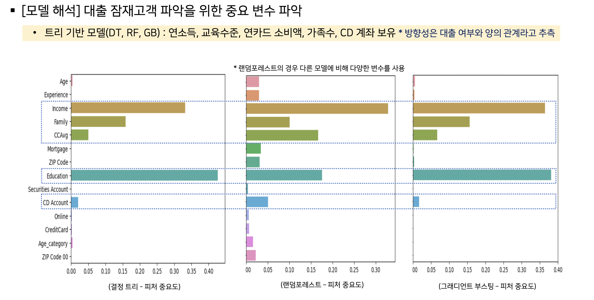

# 캐글 데이터 분석
Bank Loan modelling : Personal Loan classification problem
- ('23-1학기 데이터마이닝 수업 과제)

[과제]
- 은행의 대출 잠재고객을 파악하는 분류모델을 개발

[데이터]
Bank_Personal_Loan_Modelling
(https://www.kaggle.com/datasets/krantiswalke/bank-personal-loan-modelling)

[과정]
- (중간발표) 도메인 분석 → 데이터 전처리 → EDA → (DT) 룰 리스트 분석
- (기말발표) 모델학습 및 Color DT 적용

[EDA 주요내용]

[모델학습 주요내용]

[주요 툴]
- (데이터 프로세싱) 판다스, 넘파이
- (데이터 처리 및 모델 구현) 사이킷런
- (시각화) 맷플롯립, 시본

