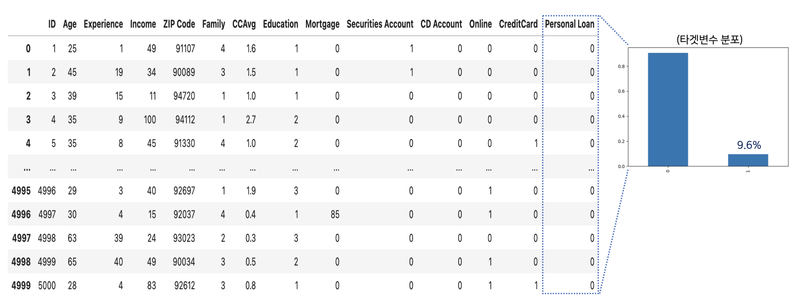
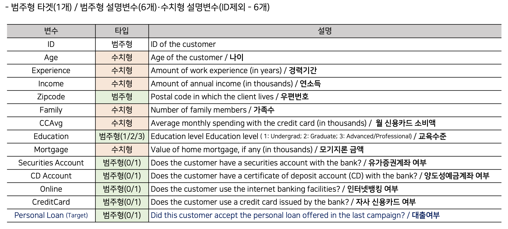
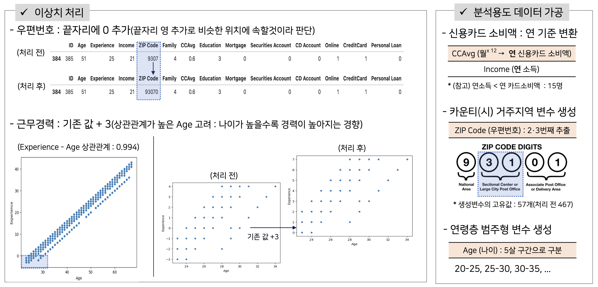
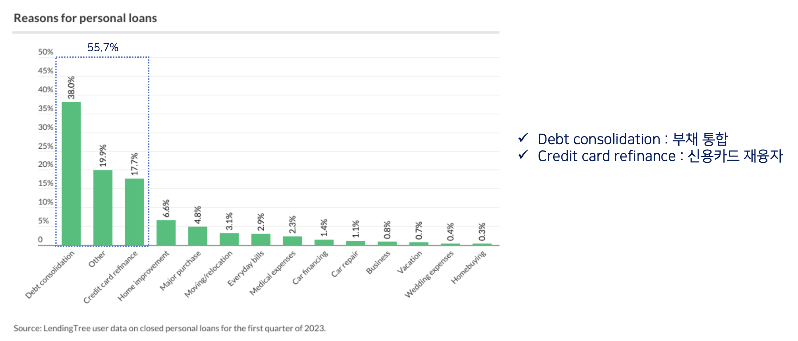
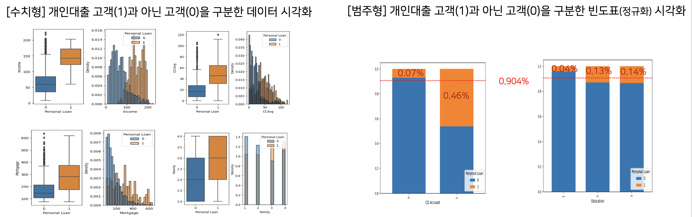
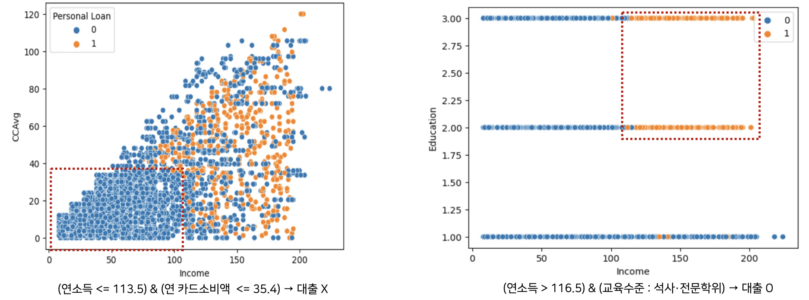
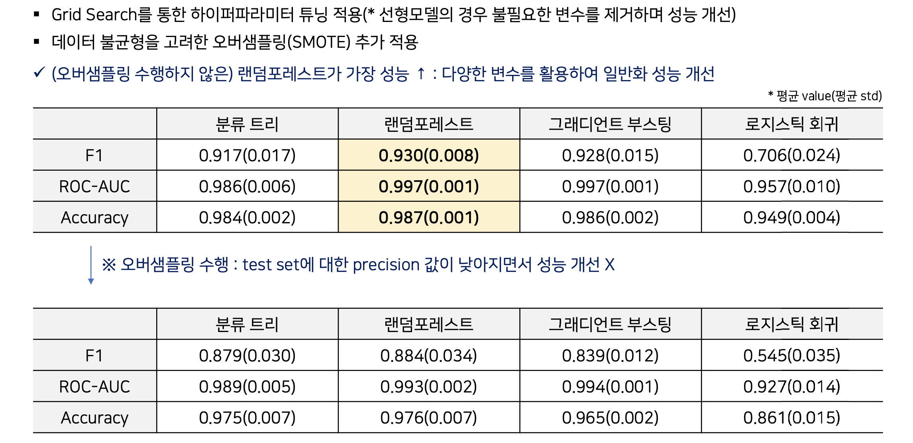
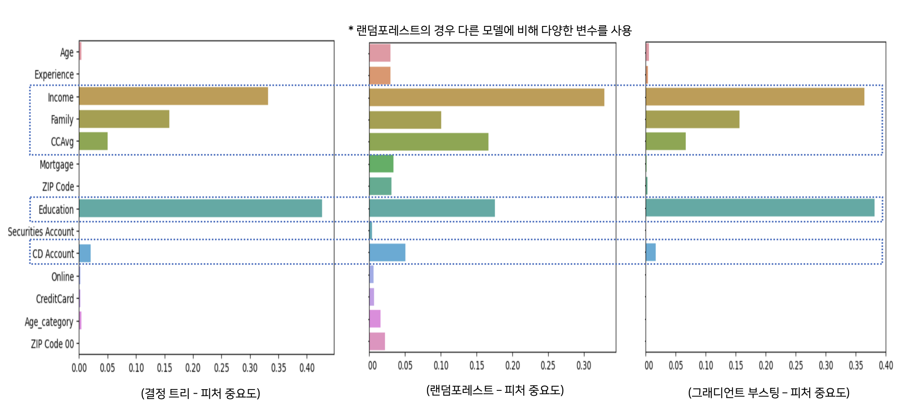
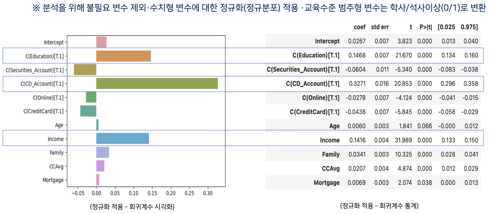

# Kaggle Data - Bank Loan modeling 
- '23-1학기 데이터마이닝 과제

### 과제
- Personal Loan Classification Problem
   
    - 은행 **대출 잠재 고객을 파악**하는 분류모델 개발

    - 잠재 고객 파악에 **중요 변수 파악 ・ 인사이트 도출**

### 데이터
> Bank Personal Loan Modeling

- https://www.kaggle.com/datasets/krantiswalke/bank-personal-loan-modelling

- 은행 대출 마케팅을 실행한 고객 정보 및 해당 **고객 대출 실행** 여부
    - 12개 독립변수(ID제외) · 1개 타겟변수(대출여부) / 5,000여개 데이터

        
        

> 데이터 전처리
- 결측값 없음 
- 이상치 처리(근무경력・우편번호) 및 데이터 가공(신용카드 연소비액・거주지역・연령층)  

     

### 분석
> 도메인 조사 : **총부채↑(현재 데이터로 파악 불가) / 연카드소비액↑** : 대출 가능성↑
- (미국) 기존 부채를 통합·신용카드 금액을 재융자하는데 개인대출을 많이 활용

            

> EDA : **연 소득↑ / 연 카드소비↑ / 모기지론↑ /가족 수↑ / CD계좌 보유 / 석사이상** : 대출가능성↑
- 독립변수 - 타겟변수간 관계 분석・시각화

     

> Decision Tree Rule : **(중요변수) 연소득↑ / 석사이상** : 대출가능성↑
- 교차검증 수행 트리(평균 정확도: 0.981, 평균 F1: 0.895) 중 특정 트리에서 룰 리스트 추출

     

### 모델학습
- 중요 변수 파악을 위한 4개 모델 선택 : **분류 트리·랜덤포레스트·그래디언트 부스팅·로지스틱 회귀** 

    

> 트리 기반 모델 : **연 소득 / 연 카드소비 / 가족 수 / CD계좌 보유 / 교육수준** : 대출에 중요 (*단, 양의 관계 추측)

- 트리 기반 모델 - 변수 중요도 분석

    

> 로지스틱 회귀 : **연소득 ↑ / CD계좌 보유 / 석사이상** : 대출 가능성↑ (*단, 모델 적합도가 낮은 한계)
- 로지스틱 회귀 - 회귀 계수 분석

    

### 종합해석

- 도메인 조사 · EDA · DT 기반 분석과 모델 분석 기반 중요 변수가 동일하다고 판단

    - **[중요변수] 연소득, 연 카드소비액, 교육수준, 가족 수, CD(양도성예금증서) 계좌 여부**

- [인사이트]
    - **고학력 고소득 고객층**이 개인대출을 받을 가능성이 높다. 

        - 고소득 기준 : 연소득 기준 상위 20%

    - 중·저소득층에서 소비가 적은 고객은 특히 대출 가능성이 낮다. 
        - 소비 적음 기준 : 연 카드소비액 기준 하위 20% 
    - **가족 수나 양도성예금증서 보유 여부**를 잠재고객 판단에 활용할 수 있다.

### 주요 툴
- (데이터 처리) Python, Pandas, Numpy

- (모델 구현) Sklearn

- (데이터 시각화) Matplotlib, Seaborn

